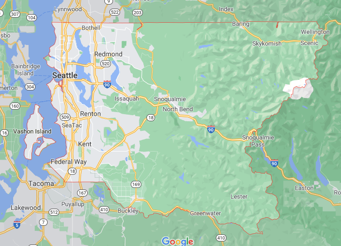

# 1st_Project - King County House Data Set
This repository includes the results of my first data science project during my data science bootcamp at neuefische in Hamburg. 

This project includes work with the complete data science lifecycle on a dataset. The given dataset is the King County House dataset, which includes sales in the King County Area from Mai 2014 to End of May 2015. My task in this project is to figure out at least 3 recommendations for buyers based on the given dataset and developed features. To get an impression about the area, lets have a look on the map of King County.

This repository includes the following data:
- Jupiter notebook with all steps of the data science lifecycle [Jupyter Notebook](First_Project_King_County_Housing_Prices.ipynb)
- Slides of the Presentation as a PDF-file [Slides](1st_Project_King_County_Houses_Slides.pdf)
- under [figures](figures) the ouput figures are stored 
- under [rawdata](rawdata) the original dataset and the column description are stored

The online presentation on GSlides id [here](https://docs.google.com/presentation/d/1chOp8RtzKma1fxankIJmB3cIftoIgIjdNbuErxfaEFQ/edit?usp=sharing)

The focus of this project is mainly on EDA (Exploratory Data Analysis), but during the project all steps of the data science lifecycle are conducted. These steps are summed up in the following:

## Business Understanding
- What is the objective of this project?
- What prolems need to be tackled?

## Data Mining
- Get data or scrape data.

## Data Cleaning
- Fix missing data
- Fix inconsistencies based on assumptions. 

## Data Exploration
Visually analyze your data by using:
- Correlation analysis
- Heatmap
- Histograms
- Scatter Plots
- Box plots
- Surface Plots

## Feature Engineering
Select important features and develop new and more meaningful data.
In this project new features regarding the age, distance to Seattle and renovation were developed. 

## Predictive Modelling
Use machine algorithms to make predictions. In this case: 
- single linear regression
- multivariate linear regression

## Data Visualization
Communicate the key findings using plots and visualizations.
In this project this is a presentation to non-technical stakeholders. 